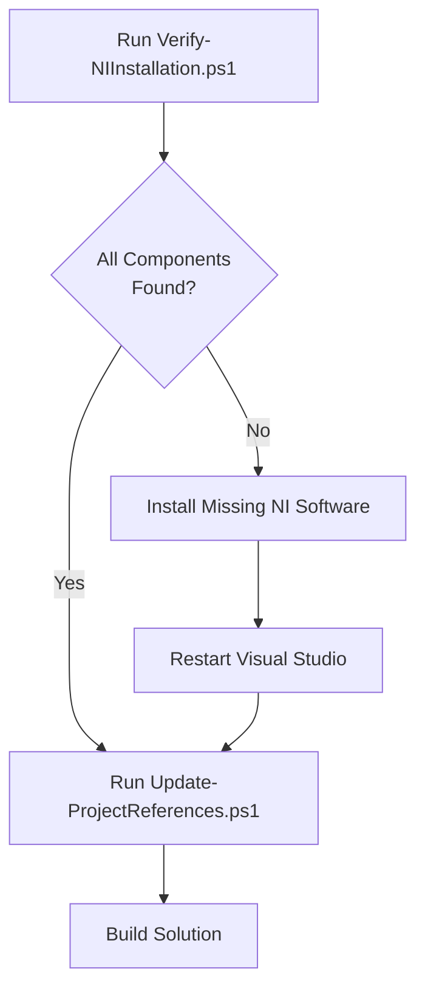

# Build Tools - NI Assembly Dependency Management

This directory contains automated tools for managing National Instruments (NI) assembly dependencies across different development machines.

## Overview

When working with NI hardware and software, assembly references can vary between machines based on:
- Different NI software versions installed
- Different installation paths
- Missing or incomplete NI software installations

These tools automate the discovery and configuration of NI assemblies, making it easy to set up the project on new systems.

## Tools

### 1. `Verify-NIInstallation.ps1`
**Purpose:** Checks if all required NI software is installed on your system.

**Usage:**
```powershell
.\Verify-NIInstallation.ps1
```

**What it does:**
- ✓ Checks for all required NI assemblies
- ✓ Verifies .NET Framework version
- ✓ Detects Visual Studio installation
- ✓ Provides a detailed status report
- ✓ Lists missing packages with download links

**When to use:**
- First time setting up the project on a new machine
- After installing or updating NI software
- Troubleshooting build issues

### 2. `Find-NIAssemblies.ps1`
**Purpose:** Discovers NI assemblies installed on your system.

**Usage:**
```powershell
# Find all assemblies (table format)
.\Find-NIAssemblies.ps1

# Find specific assembly
.\Find-NIAssemblies.ps1 -AssemblyName "NationalInstruments.RFmx.WlanMX.Fx40"

# Output as JSON
.\Find-NIAssemblies.ps1 -OutputFormat Json

# Generate .csproj XML fragments
.\Find-NIAssemblies.ps1 -OutputFormat ProjectXml
```

**Output Formats:**
- `Table` - Human-readable table (default)
- `Json` - JSON format for scripting
- `Xml` - XML format
- `ProjectXml` - Ready-to-use .csproj `<Reference>` elements

**When to use:**
- Manually checking which NI assemblies are available
- Debugging path issues
- Generating reference configurations

### 3. `Update-ProjectReferences.ps1`
**Purpose:** Automatically updates project files with correct assembly paths for your system.

**Usage:**
```powershell
# Update default project (with backup)
.\Update-ProjectReferences.ps1

# Update specific project
.\Update-ProjectReferences.ps1 -ProjectPath "..\src\MyProject\MyProject.csproj"

# Preview changes without applying them
.\Update-ProjectReferences.ps1 -WhatIf

# Update without creating backup
.\Update-ProjectReferences.ps1 -Backup $false
```

**What it does:**
- ✓ Discovers all NI assemblies on your system
- ✓ Updates HintPath elements in .csproj files
- ✓ Creates backup of original project file
- ✓ Handles multiple versions (uses latest)
- ✓ Reports all changes made

**When to use:**
- First time building on a new machine
- After updating NI software versions
- When assembly reference errors occur

## Quick Start Guide

### For New Developers

When you first clone this repository on a new machine:

```powershell
# 1. Navigate to build-tools directory
cd build-tools

# 2. Verify your NI installation
.\Verify-NIInstallation.ps1

# 3. If all checks pass, update project references
.\Update-ProjectReferences.ps1

# 4. Return to solution directory and build
cd ..
dotnet build
```

### Installation Workflow

If verification shows missing components:



## Required NI Software

This project requires the following NI software packages:

| Package | Purpose | Min Version |
|---------|---------|-------------|
| **NI-RFmx WLAN** | WLAN RF measurement APIs | 23.0.0 |
| **NI-RFSG** | Signal generator driver | 23.0.0 |
| **IVI Shared Components** | IVI driver foundation | 2.0.0 |

### Installation Methods

#### Option 1: NI Package Manager (Recommended)
1. Download [NI Package Manager](https://www.ni.com/en-us/support/downloads/software-products/download.ni-package-manager.html)
2. Launch NI Package Manager
3. Search for and install:
   - NI-RFmx WLAN
   - NI-RFSG
4. Accept dependency packages when prompted

#### Option 2: Manual Download
1. Visit [NI Downloads](https://www.ni.com/en-us/support/downloads.html)
2. Download each required package
3. Run installers

## How It Works

### Assembly Discovery Process

The tools search the following locations for NI assemblies:

```
C:\Windows\Microsoft.NET\assembly\GAC_MSIL\
├── NationalInstruments.Common\
├── NationalInstruments.RFmx.InstrMX.Fx40\
└── NationalInstruments.RFmx.WlanMX.Fx40\

C:\Program Files (x86)\IVI Foundation\IVI\Microsoft.NET\
├── Framework32\v4.0.30319\
│   ├── NationalInstruments.ModularInstruments.Common\
│   └── NationalInstruments.ModularInstruments.NIRfsg\
└── Framework64\v2.0.50727\
    └── IviFoundationSharedComponents\

C:\Program Files (x86)\National Instruments\
└── MeasurementStudioVS2010\DotNET\Assemblies\
    └── NationalInstruments.ModularInstruments.NIRfsgPlayback.Fx40.dll
```

### Project Update Process

1. **Scan System** - Discovers all NI assemblies
2. **Parse Project** - Loads .csproj as XML
3. **Update HintPaths** - Modifies `<Reference>` elements
4. **Create Backup** - Saves `.backup` copy
5. **Save Changes** - Writes updated .csproj

## Troubleshooting

### "Assembly not found" after running Update-ProjectReferences

**Cause:** NI software not installed or version mismatch

**Solution:**
```powershell
.\Verify-NIInstallation.ps1
# Follow recommendations to install missing components
```

### Multiple versions found, wrong one selected

**Behavior:** Scripts select the most recently modified version

**Solution:** Uninstall older versions through Windows Control Panel or NI Package Manager

### PowerShell execution policy error

**Error:** "cannot be loaded because running scripts is disabled"

**Solution:**
```powershell
Set-ExecutionPolicy -ExecutionPolicy RemoteSigned -Scope CurrentUser
```

### Manual override needed

If automatic detection fails, you can manually edit the .csproj:

```xml
<Reference Include="NationalInstruments.RFmx.WlanMX.Fx40">
  <HintPath>C:\Your\Custom\Path\NationalInstruments.RFmx.WlanMX.Fx40.dll</HintPath>
</Reference>
```

## Advanced Usage

### Automating in CI/CD

```powershell
# Non-interactive validation
$result = .\Verify-NIInstallation.ps1
if ($LASTEXITCODE -ne 0) {
    Write-Error "NI components missing"
    exit 1
}

# Update project references
.\Update-ProjectReferences.ps1 -Backup $false -WhatIf:$false
```

### Custom Search Paths

Modify the `$SearchPaths` array in the scripts to add custom locations:

```powershell
$SearchPaths = @(
    "C:\CustomNIPath\assemblies",
    # ... existing paths ...
)
```

### Batch Processing Multiple Projects

```powershell
$projects = @(
    "..\src\Project1\Project1.csproj",
    "..\src\Project2\Project2.csproj"
)

foreach ($proj in $projects) {
    .\Update-ProjectReferences.ps1 -ProjectPath $proj
}
```

## Best Practices

### For Development Teams

1. **Version Control:** Commit these scripts to your repository
2. **Documentation:** Keep NI version requirements updated in this README
3. **Onboarding:** Include these scripts in new developer setup guides
4. **CI/CD:** Run `Verify-NIInstallation.ps1` in build pipelines

### For Individual Developers

1. **First Build:** Always run `Verify-NIInstallation.ps1` before building
2. **After Updates:** Re-run `Update-ProjectReferences.ps1` after NI updates
3. **Clean Builds:** Delete `bin/` and `obj/` folders after updating references
4. **Backups:** Keep project backups when updating references

## Contributing

To improve these tools:

1. Test on different NI software versions
2. Add support for additional NI products
3. Enhance error messages and reporting
4. Add support for other project types (C++, Python, etc.)

## License

These scripts are part of the RF Test Sequencer project. Use and modify as needed for your development environment.

## Related Documentation

### For Developers
- **[QUICKSTART.md](QUICKSTART.md)** - 3-step quick start for first-time setup
- **[QUICK_REFERENCE.md](QUICK_REFERENCE.md)** - One-page command cheat sheet
- **[../docs/SETUP_NEW_MACHINE.md](../docs/SETUP_NEW_MACHINE.md)** - Detailed onboarding guide
- **[../docs/GIT_SAFETY_GUIDE.md](../docs/GIT_SAFETY_GUIDE.md)** - Git best practices

### For AI Assistants
- **[../.copilot/skills/dependency-management.md](../.copilot/skills/dependency-management.md)** - Complete technical skill
- **[../.copilot/skills/dependency-status.md](../.copilot/skills/dependency-status.md)** - Current project state
- **[../.copilot/README.md](../.copilot/README.md)** - AI skills index

---

## Support

For issues related to:
- **These scripts:** Contact the development team or create an issue
- **NI software:** Visit [ni.com/support](https://www.ni.com/support)
- **Project setup:** See main repository README.md
